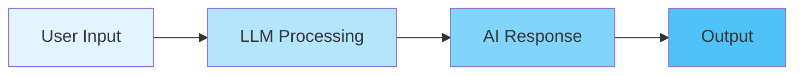
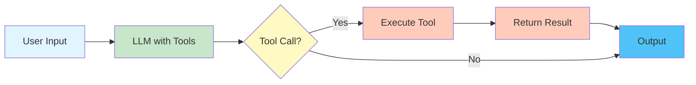
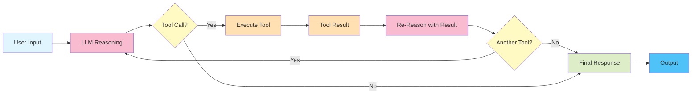
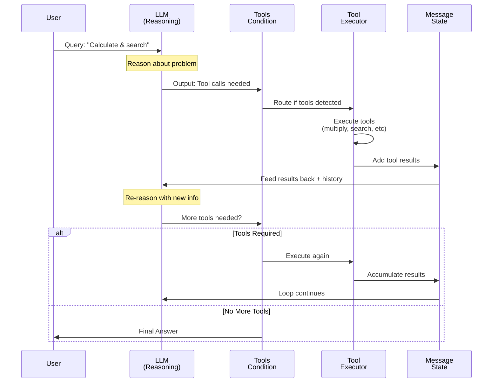
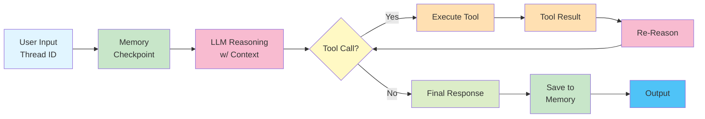

# 🤖 Agentic LangGraph Project

> Building intelligent AI agents using **LangGraph** - A framework for orchestrating complex, multi-step AI workflows with state management and graph-based execution.

## 📋 Overview

**Agentic_LangGraph** is a comprehensive educational project demonstrating the evolution from basic chatbots to sophisticated AI agents. It showcases four increasingly complex patterns:

1. **Basic Chatbot** - Direct LLM conversation
2. **Tool-Calling Agent** - LLM with external tools and conditional routing
3. **ReACT Agent** - Multi-turn reasoning with loop-based tool calling
4. **ReACT Agent with Memory** - Persistent conversation state with thread-based conversations

This repository is perfect for learning how to build production-ready AI applications using modern agent architectures with memory persistence and streaming capabilities.

---

## 🎯 Project Goals

✨ **Understand LangGraph fundamentals** - State graphs, workflows, and execution flow  
🔧 **Build AI agents** - Create agents that reason, plan, and take actions  
🌐 **External integration** - Connect to APIs, tools, and custom functions  
🔄 **Multi-turn reasoning** - Implement ReACT loops for complex problem solving  
📊 **Scalable patterns** - Learn architectures that work for simple and complex scenarios  

---

## 📁 Project Structure

```
Agentic_langgraph/
├── main.py                    # Entry point / starter template
├── pyproject.toml             # Project configuration (Python 3.14+)
├── requirements.txt           # All dependencies
├── README.md                  # This file
├── PROJECT_OVERVIEW.md        # Detailed project documentation
├── .env                       # API keys (gitignored)
├── .gitignore                 # Git configuration
└── Basic_Chatbot/
    └── basic_chatbot.ipynb    # Complete interactive notebook with all patterns
```

---

## 🔧 Core Dependencies

| Package | Purpose |
|---------|---------|
| **langgraph** | Graph-based state orchestration for AI workflows |
| **langchain** | LLM integration and chaining framework |
| **langchain-groq** | Groq API integration (fast LLM inference) |
| **langchain-tavily** | Web search tool integration |
| **langsmith** | Monitoring and debugging for LangChain apps |
| **python-dotenv** | Secure environment variable management |
| **ipykernel** | Jupyter notebook execution || **nest-asyncio** | Nested async event loops for Jupyter |
---

## 🚀 Getting Started

### Prerequisites
- Python 3.14+
- API keys for:
  - [Groq](https://console.groq.com/) - Fast LLM API
  - [Tavily](https://tavily.com/) - Web search API

### Installation

```bash
# Clone and navigate
cd Agentic_langgraph

# Set up environment variables
echo "GROQ_API_KEY=your_key_here" > .env
echo "TAVILY_API_KEY=your_key_here" >> .env

# Install dependencies
pip install -r requirements.txt
# OR using UV (faster package manager)
uv pip install -r requirements.txt

# Open notebook
jupyter notebook Basic_Chatbot/basic_chatbot.ipynb
```

---

## 📚 Architecture Patterns

### Pattern 1️⃣: Basic Chatbot

The simplest pattern - direct conversation with an LLM.



**Flow:**
- User sends a message
- LLM processes the message
- Response is returned directly
- No external tools or reasoning

**Use cases:** Simple Q&A, chitchat, basic information retrieval

**Key code:**
```python
class State(TypedDict):
    messages: Annotated[list, add_messages]

def chatbot_node(state: State):
    return {"messages": [llm.invoke(state["messages"])]}

graph_builder.add_edge(START, "chatbot_node")
graph_builder.add_edge("chatbot_node", END)
```

---

### Pattern 2️⃣: Tool-Calling Agent

Adds tool calling capability with conditional routing - no loops.



**Flow:**
- User sends a query
- LLM decides if tools are needed
- If yes → execute tools (Tavily search, custom functions)
- Return tool results as context
- LLM generates final response
- No re-reasoning loop

**Supported Tools:**
- 🔍 **Tavily Search** - Web search for real-time information
- 🔢 **Custom Functions** - multiply(), add any custom logic

**Use cases:** Queries needing web search, calculations without re-reasoning

**Key code:**
```python
tools = [tavily_search_tool, multiply_func]
llm_with_tools = llm.bind_tools(tools)

builder.add_node("llm", tool_calling_llm)
builder.add_node("tools", ToolNode(tools=tools))

builder.add_conditional_edges("llm", tools_condition)
builder.add_edge("tools", END)
```

---

### Pattern 3️⃣: ReACT Agent (Reasoning Loop)

Full reasoning architecture with multi-turn tool calling - implements Reason → Act → Observe loops.



**Flow:**
1. **Reasoning** - LLM analyzes the problem
2. **Acting** - Calls relevant tools concurrently
3. **Observing** - Receives tool results
4. **Loop** - Re-reasons with new information (up to max iterations)
5. **Conclusion** - Provides final answer

**Supported Tools (Expandable):**
- 🔍 Tavily Search
- ➕ add(a, b)
- ✖️ multiply(a, b)
- ➗ divide(a, b)
- *Custom functions easily added*

**Use cases:** Complex multi-step reasoning, combining multiple tools, adaptive problem-solving

**Example Query:**
```
"What is 104587695 × 95485? 
 Also get latest news on SpaceX IPO in June 2026. 
 Then add 46 + 24 and divide by 4."
```

**Key code:**
```python
tools = [tavily_search, multiply, add, divide]
llm_with_tools = llm.bind_tools(tools=tools)

builder.add_edge(START, "llm_reasoning")
builder.add_conditional_edges("llm_reasoning", tools_condition)
builder.add_edge("tools", "llm_reasoning")  # Loop back for re-reasoning
builder.add_edge("llm_reasoning", END)
```

---

### 🔁 ReACT Tool-Calling Loop (Detailed)

Deep dive into how the ReACT agent iteratively reasons and calls tools:



**Key Points:**
- ✅ **Accumulating Context** - Message state preserves thinking + tool results
- ✅ **Multiple Tool Calls** - Can call multiple tools in parallel per iteration
- ✅ **Iterative Refinement** - Reasoning improves with each tool result
- ✅ **Smart Termination** - LLM decides when enough information is gathered
- ✅ **Tool History** - All tool calls and results visible to LLM for context

**Message Flow Example:**

```
Iteration 1:
├─ LLM Input: [User Query]
├─ LLM Output: [Thought] + [Tool Calls: multiply(104587695, 95485), search("SpaceX IPO")]
├─ Tool Results: [10017356... , "Search result details..."]
└─ State Update: Add all messages

Iteration 2:
├─ LLM Input: [User Query] + [All Previous Thinking] + [Tool Results]
├─ LLM Output: [Thought] + [Tool Calls: add(46, 24), divide(70, 4.0)]
├─ Tool Results: [70, 17.5]
└─ State Update: Accumulate messages

Iteration 3:
├─ LLM Input: [Full message history with all results]
├─ LLM Output: [Final Answer] (No tool calls)
└─ Return to User: Final response with all context
```

---

### Pattern 4️⃣: ReACT Agent with Memory & Streaming

Advanced ReACT agent with **persistent conversation memory** and **streaming capabilities**.



**Flow:**
1. **Multi-thread Support** - Maintain separate conversation histories via `thread_id`
2. **Memory Checkpoint** - Persistent state using `MemorySaver`
3. **ReACT Loop** - Full reasoning with tool calling
4. **Streaming Support** - Real-time event streaming
5. **Context Preservation** - LLM has access to entire conversation history

**Key Features:**
- 💾 **Persistent Memory** - Conversations saved across sessions
- 🔄 **Thread-based Conversations** - Multiple independent conversations by thread ID
- 📡 **Multiple Streaming Modes**:
  - `stream_mode="updates"` - Only updates for changed nodes
  - `stream_mode="values"` - Full state at each step
  - `astream_events()` - Async event streaming for real-time monitoring
- 📚 **Full Context** - LLM sees all previous messages in conversation
- 🔁 **State Accumulation** - Message history grows with each interaction

**Configuration:**
```python
config = {"configurable": {"thread_id": "user_123"}}

# Single invoke with memory
response = graph.invoke({"messages": "Tell me a joke"}, config=config)

# Streaming updates (only changed nodes)
for chunk in graph.stream({"messages": "What is AI?"}, config=config, stream_mode="updates"):
    print(chunk)

# Streaming values (full state at each step)
for chunk in graph.stream({"messages": "Hello"}, config=config, stream_mode="values"):
    print(chunk)

# Async event streaming with full visibility
async for event in graph.astream_events({"messages": input}, config=config, version="v2"):
    print(event)
```

**Use Cases:**
- 🤖 Stateful chatbots with conversation history
- 💬 Multi-turn conversations with context awareness
- 📊 Real-time streaming responses to users
- 🔍 Full visibility into agent reasoning process
- 👥 Multi-user scenarios with separate threads

**Example - Multi-turn Conversation:**
```python
# User 1 - Thread ID "user_1"
config1 = {"configurable": {"thread_id": "user_1"}}
response1 = graph.invoke({"messages": "Hi, I'm Alice"}, config=config1)
response2 = graph.invoke({"messages": "What's my name?"}, config=config1)
# LLM remembers: "Your name is Alice"

# User 2 - Thread ID "user_2" (separate history)
config2 = {"configurable": {"thread_id": "user_2"}}
response3 = graph.invoke({"messages": "Hi, I'm Bob"}, config=config2)
response4 = graph.invoke({"messages": "What's my name?"}, config=config2)
# LLM remembers: "Your name is Bob"
# No cross-contamination between threads!
```

**Memory Implementation:**
```python
from langgraph.checkpoint.memory import MemorySaver

memory = MemorySaver()
graph = builder.compile(checkpointer=MemorySaver())
# Each thread_id has its own checkpoint in memory
```

---

## 🔄 State Management

All patterns use a unified state structure:

```python
class State(TypedDict):
    messages: Annotated[list, add_messages]
```

- **messages**: List of conversation messages
- **add_messages**: Utility that intelligently merges messages (handles duplicates, ordering)
- **Annotated**: TypedDict with reducer functions for smart state updates

---

## 🛠️ Tools Available

### 1. **Tavily Web Search**
```python
tool = TavilySearch(max_results=2, tavily_api_key=os.getenv("TAVILY_API_KEY"))
tool.invoke("What is the latest AI news?")
```
- Real-time web search capability
- Max results configurable
- Returns: structured search results with sources

### 2. **Mathematical Functions**
```python
def multiply(a: int, b: int) -> int:
    """Multiply a and b"""
    return a * b

def add(a: int, b: float) -> float:
    """Add a and b"""
    return a + b

def divide(a: float, b: float) -> float:
    """Divide a by b"""
    return a / b
```

---

## 💡 Key Concepts

### State Graphs
- **Nodes**: Processing units (LLM reasoning, tool execution)
- **Edges**: Connections between nodes
- **Conditional Edges**: Route based on LLM output (tool call or direct response)
- **Loops**: ReACT pattern enables iterative reasoning

### Tool Binding
```python
llm_with_tools = llm.bind_tools(tools=[tool1, tool2])
```
- Transforms LLM to understand when tools are needed
- Returns tool calls in structured format
- Tools automatically executed by ToolNode

### Conditional Routing
```python
from langgraph.prebuilt import tools_condition

builder.add_conditional_edges("llm_node", tools_condition)
```
- Examines LLM output
- Routes to "tools" if tool calls present
- Routes to END/next node otherwise

---

## 📊 Execution Flow Comparison

| Aspect | Basic | Tool-Calling | ReACT | ReACT + Memory |
|--------|-------|--------------|-------|----------------|
| **Nodes** | 1 | 2 | 2 | 2 + Checkpoint |
| **Loop** | No | No | Yes | Yes |
| **External Tools** | No | Yes | Yes | Yes |
| **Reasoning Cycles** | 1 | 1 | Multiple | Multiple |
| **Memory/State** | None | None | None | Persistent |
| **Thread Support** | - | - | - | Multi-thread |
| **Streaming** | No | No | No | Yes |
| **Complexity** | Low | Medium | High | Very High |
| **Use Case** | Simple chat | Tool queries | Complex reasoning | Stateful assistants |

---

## 🎓 Learning Path

1. **Start here**: Run the Basic Chatbot cells sequentially
2. **Understand**: Read flow diagrams and comments in notebook
3. **Experiment**: Modify prompts and observe LLM behavior
4. **Add tools**: Extend with your own functions or APIs
5. **Build**: Create your own agent combining patterns
6. **Deploy**: Use these patterns in production applications

---

## � Streaming & Memory Capabilities

### Real-time Event Streaming

The project supports multiple streaming modes for real-time monitoring and response generation:

**1. Update Streaming** - Only changes at each node
```python
for chunk in graph.stream(input_data, config, stream_mode="updates"):
    # Only changed nodes are included
    # Lighter payload, better for UI updates
    print(chunk)
```

**2. Values Streaming** - Full state at each step
```python
for chunk in graph.stream(input_data, config, stream_mode="values"):
    # Complete state snapshot at each iteration
    # Useful for state reconstruction
    print(chunk)
```

**3. Async Event Streaming** - Full event pipeline visibility
```python
async for event in graph.astream_events(input_data, config, version="v2"):
    # Real-time events from the entire execution
    # Perfect for detailed monitoring and logging
    print(event)
```

### Persistent Memory with Thread Isolation

The `MemorySaver` checkpoint system enables conversation persistence with complete thread isolation:

**Thread-based Separation:**
```python
# Each thread_id maintains independent state
thread_1_config = {"configurable": {"thread_id": "alice"}}
thread_2_config = {"configurable": {"thread_id": "bob"}}

# No cross-contamination between users
graph.invoke({"messages": "Hi, I'm Alice"}, config=thread_1_config)
graph.invoke({"messages": "Hi, I'm Bob"}, config=thread_2_config)
```

**Features:**
- ✅ **Conversation History** - Full message history accessible in each invocation
- ✅ **Context Awareness** - LLM has full conversation context for better responses
- ✅ **Multi-user Support** - Separate threads for separate users/conversations
- ✅ **State Checkpoints** - Intermediate states saved at each step
- ✅ **Recovery** - Resume conversations from any checkpoint

---

## 🔒 Security

- ✅ API keys stored in `.env` (gitignored)
- ✅ Secrets removed from git history
- ✅ Use environment variables for all credentials
- ⚠️ **Never commit `.env` file**
- 🔄 Rotate keys if accidentally exposed
- 🔐 **Thread Isolation** - Each conversation thread is isolated (no cross-user data leaks)

---

## 📈 Extending the Project

### Add New Tools
```python
def custom_tool(param: str) -> str:
    """Your custom tool description"""
    # Implementation
    return result

tools.append(custom_tool)
llm_with_tools = llm.bind_tools(tools=[old_tools..., custom_tool])
```

### Switch LLM Providers
```python
# Try different models
llm = ChatOpenAI(model="gpt-4")
llm = ChatAnthropic(model="claude-3-opus")
```

### Add Error Handling
```python
try:
    response = graph.invoke({"messages": user_input})
except Exception as e:
    print(f"Error: {e}")
```

---

## 📚 Resources

- 📖 [LangGraph Documentation](https://python.langchain.com/docs/langgraph/)
- 📖 [LangChain Agents](https://python.langchain.com/docs/concepts/agents/)
- 📖 [ReACT Paper](https://arxiv.org/abs/2210.03629)
- 🎯 [Groq API Docs](https://console.groq.com/docs)
- 🔍 [Tavily API Docs](https://docs.tavily.com/)

---

## 🏗️ Project Status

**Phase**: Advanced Development & Production-Ready  
**Last Updated**: June 2026  
**Status**: Educational & Production-Ready Patterns  

### Completed ✅
- Basic chatbot implementation
- Tool-calling agent with conditional routing
- ReACT agent with reasoning loops
- **ReACT agent with persistent memory (NEW)**
- **Multi-thread conversation support (NEW)**
- **Streaming capabilities - updates/values/events (NEW)**
- Multiple tool integration (Tavily + custom functions)
- Comprehensive documentation with flow diagrams
- Thread-based conversation isolation
- Memory checkpointing system

### Future Enhancements 🚀
- Persistent database storage (instead of in-memory)
- Max iteration limits and timeout handling
- Tool result validation and error recovery
- Advanced error handling strategies
- Function calling with parallel tool execution
- Multi-agent orchestration
- Production deployment examples (FastAPI integration)
- Advanced memory pruning strategies

---

## 💬 Contributing & Feedback

This is an educational project. Feel free to:
- Experiment with different LLMs
- Add your own tools
- Create new agent patterns
- Share improvements

---

**Made with ❤️ for learning AI agent development**

### Location
[`Basic_Chatbot/basic_chatbot.ipynb`](Basic_Chatbot/basic_chatbot.ipynb)

### What It Does

This Jupyter notebook demonstrates creating a **simple conversational AI agent** using LangGraph's state graph architecture:

#### Key Components

1. **State Definition**
   ```python
   class State(TypedDict):
       messages: Annotated[list, add_messages]
   ```
   - Defines the data structure that flows through the graph
   - Uses `add_messages` utility for intelligent message accumulation

2. **LLM Integration**
   - Uses **Groq's Llama-3.1-8B** model for fast inference
   - Configured via environment variables (API key)
   - Two initialization methods shown:
     - Direct `ChatGroq` initialization
     - Generic `init_chat_model` approach

3. **Chatbot Node**
   ```python
   def chatbot_node(state: State):
       return {"messages": [llm2.invoke(state["messages"])]}
   ```
   - Core processing node that generates responses
   - Takes current message state and produces AI-generated replies

4. **Graph Construction**
   - **START** → **chatbot_node** → **END**
   - Simple linear flow for basic conversation
   - Graph is compiled to create an executable workflow

#### Usage Patterns Demonstrated

- **Single Invocation**: `graph.invoke({"messages": "Hi"})`
  - Direct input/output for single queries

- **Streaming**: `graph.stream({"messages": "How are you?"})`
  - Real-time event streaming for progressive message generation
  - Useful for displaying responses as they're generated

#### Example Features

✨ The notebook demonstrates:
- Loading environment variables safely
- Initializing language models
- Building state graphs programmatically
- Visualizing graph structure (Mermaid diagram)
- Invoking chatbot with single and streaming modes
- Extracting and displaying generated content

---

## 🚀 Getting Started

### Prerequisites
- Python 3.14 or higher
- API key for Groq (free tier available)

### Installation

1. **Clone/Navigate to the project**
   ```bash
   cd Agentic_langgraph
   ```

2. **Set up environment**
   ```bash
   # Create .env file
   echo "GROQ_API=your_groq_api_key" > .env
   ```

3. **Install dependencies**
   ```bash
   pip install -r requirements.txt
   # OR using UV (faster package manager)
   uv pip install -r requirements.txt
   ```

4. **Run the chatbot notebook**
   - Open `Basic_Chatbot/basic_chatbot.ipynb` in Jupyter or VS Code
   - Execute cells sequentially to build and interact with the chatbot

---

## 🔄 How LangGraph Works (In This Project)

```
┌─────────────────────────────────────────┐
│          Input Message                  │
│      {"messages": "Hi, how are you?"}   │
└────────────────┬────────────────────────┘
                 │
                 ▼
          ┌──────────────┐
          │    START     │
          └──────┬───────┘
                 │
                 ▼
         ┌──────────────────┐
         │  chatbot_node()  │ ◄──── Calls LLM with messages
         │                  │
         │ Groq LLM responds │
         └──────┬───────────┘
                │
                ▼
           ┌─────────────┐
           │     END     │
           └─────┬───────┘
                 │
                 ▼
      ┌────────────────────────┐
      │  Output with Response  │
      │ {"messages": [user_msg,│
      │             bot_reply]}│
      └────────────────────────┘
```

---

## 💡 Next Steps & Extensions

This basic chatbot is a foundation for more advanced patterns:

- **Multi-turn conversation**: Maintain conversation history
- **Tool calling**: Enable agents to use external tools/APIs
- **Conditional routing**: Route to different nodes based on conditions
- **Parallel execution**: Run multiple agent paths concurrently
- **Human-in-the-loop**: Add approval steps before actions
- **Multiple agents**: Coordinate between specialized agents

---

## 📖 Learning Resources

- [LangGraph Documentation](https://python.langchain.com/docs/langgraph/)
- [LangChain Integration Guide](https://python.langchain.com/docs/)
- [Groq API Documentation](https://groq.com/)
- [Agent Design Patterns](https://python.langchain.com/docs/concepts/agents/)

---

## 🛠️ Development

The project is configured with:
- **Modern Python packaging** (pyproject.toml)
- **Environment variable management** (python-dotenv)
- **Interactive development** (Jupyter notebooks)
- **Type hints** for better code clarity

---

## 📝 License & Attribution

This is an educational project exploring LangGraph capabilities. It's perfect for learning modern AI application development patterns.

---

**Last Updated**: June 2026  
**Status**: Active Development & Learning
